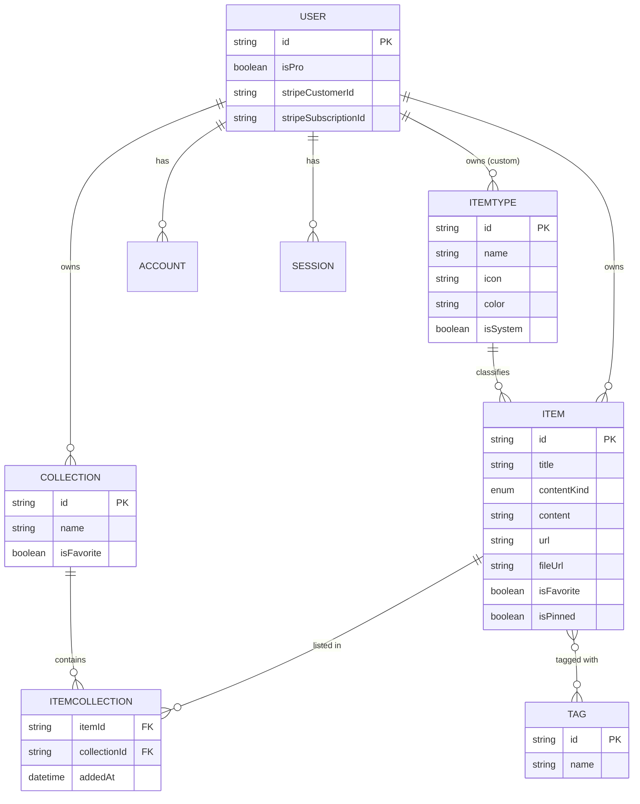
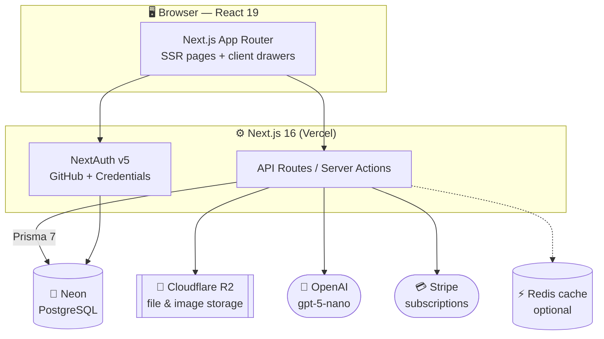
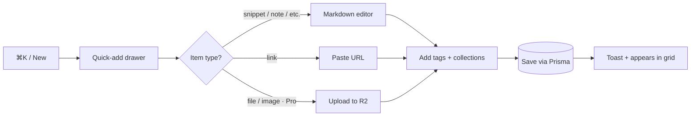

# 📦 DevStash — Project Overview

> **One fast, searchable, AI-enhanced hub for all developer knowledge & resources.**
> Snippets, prompts, commands, links, notes, and files — captured in one place, instead of scattered across VS Code, Notion, chat histories, bookmarks, gists, and `.txt` files.

**Status:** Planning / pre-build · **Type:** Freemium SaaS · **Last updated:** July 2026

---

## 🎯 Problem

Developers keep their essentials scattered across too many tools:

| Where it lives today                    | The pain                          |
| --------------------------------------- | --------------------------------- |
| Code snippets in VS Code / Notion       | No single source of truth         |
| AI prompts in chat histories            | Lost after the session ends       |
| Context files buried in projects        | Hard to find and reuse            |
| Useful links in browser bookmarks       | Disorganized, untagged            |
| Docs in random folders                  | No search across them             |
| Commands in `.txt` files & bash history | Forgotten, hard to recall         |
| Project templates in GitHub gists       | Disconnected from everything else |

The result is constant context switching, lost knowledge, and inconsistent workflows. **DevStash consolidates all of it into one keyboard-fast, searchable hub** with optional AI assistance.

---

## 👥 Target Users

| Persona                           | Primary need                                             |
| --------------------------------- | -------------------------------------------------------- |
| 🧑‍💻 **Everyday Developer**         | Quickly grab and save snippets, prompts, commands, links |
| 🤖 **AI-first Developer**         | Store prompts, contexts, workflows, system messages      |
| 🎓 **Content Creator / Educator** | Keep code blocks, explanations, course notes             |
| 🏗️ **Full-stack Builder**         | Collect patterns, boilerplates, API examples             |

---

## ✨ Features

### A. Items & Item Types

Every saved thing is an **Item**. Items have a **type**. Users can eventually create custom types, but we ship with these **7 system types** (immutable):

| Type      | Storage kind | Notes                        |
| --------- | ------------ | ---------------------------- |
| `snippet` | text         | Code, syntax-highlighted     |
| `prompt`  | text         | AI prompts / system messages |
| `note`    | text         | Markdown notes               |
| `command` | text         | Terminal / CLI commands      |
| `link`    | url          | Bookmarked URLs              |
| `file`    | file         | 🔒 Pro only                  |
| `image`   | file         | 🔒 Pro only                  |

Each type resolves to one of three **storage kinds**: `text`, `url`, or `file`. Type listing routes look like `/items/snippets`, `/items/commands`, etc.

> 💡 Items should be **fast to create and access** via a slide-out **drawer** (no full page navigation required).

### B. Collections

Users create **Collections** that can hold items of **any type**. An item can belong to **multiple** collections.

_Example:_ a React snippet could live in both **"React Patterns"** and **"Interview Prep"** simultaneously.

Sample collections: `React Patterns` (snippets, notes) · `Context Files` (files) · `Python Snippets` (snippets).

### C. Search 🔍

Powerful search across:

- **Content** (the body of the item)
- **Tags**
- **Titles**
- **Types**

### D. Authentication 🔐

- Email / password
- GitHub OAuth sign-in

### E. Quality-of-life Features

- ⭐ Favorite collections and items
- 📌 Pin items to the top
- 🕒 Recently used
- 📥 Import code from a file
- 📝 Markdown editor for text types
- ⬆️ File upload for file/image types
- 📤 Export data in multiple formats
- 🌙 Dark mode (default for devs), light mode optional
- 🔀 Add/remove items to/from multiple collections
- 👁️ View which collections an item belongs to

### F. AI Features 🔒 _(Pro only)_

- 🏷️ **AI auto-tag** suggestions
- 📄 **AI summaries**
- 💡 **Explain this code**
- 🎛️ **Prompt optimizer**

---

## 🗄️ Data Model

### Entity relationships



### Prisma schema — _rough draft_

> ⚠️ **This is a rough draft, not migration-ready.** Field names, enums, and relations will change.
>
> **Prisma 7 note:** v7 ships the new Rust-free `prisma-client` generator, which **requires an explicit `output` path**. Evolve the schema **only** via `prisma migrate dev` → then `prisma migrate deploy` in prod. **Never** use `db push` or edit the DB structure directly (per project rule).

```prisma
// ⚠️ ROUGH DRAFT — subject to change.

generator client {
  provider = "prisma-client"          // Prisma 7 default (Rust-free). NOT prisma-client-js.
  output   = "../src/generated/prisma" // now required in v7
}

datasource db {
  provider = "postgresql"
  url      = env("DATABASE_URL")       // Neon (pooled) connection string
}

// ─────────────────────────────────────────────
// Enums
// ─────────────────────────────────────────────

/// How an item's payload is stored.
/// ⚠️ Spec's ITEM block listed only (text | file); the feature list implies a
/// third `url` bucket for links. Using 3 values here — reconcile before finalizing.
enum ContentKind {
  TEXT   // snippet, prompt, note, command
  URL    // link
  FILE   // file, image (Pro)
}

// ─────────────────────────────────────────────
// Auth — NextAuth v5 / Auth.js
// ─────────────────────────────────────────────

model User {
  id                   String    @id @default(cuid())
  name                 String?
  email                String?   @unique
  emailVerified        DateTime?
  image                String?
  passwordHash         String?   // for email/password sign-in

  // Billing
  isPro                Boolean   @default(false)
  stripeCustomerId     String?   @unique
  stripeSubscriptionId String?   @unique

  // Relations
  accounts    Account[]
  sessions    Session[]
  items       Item[]
  collections Collection[]
  itemTypes   ItemType[]   // custom (non-system) types owned by this user

  createdAt   DateTime @default(now())
  updatedAt   DateTime @updatedAt
}

model Account {
  id                String  @id @default(cuid())
  userId            String
  type              String
  provider          String  // "github", "credentials"
  providerAccountId String
  refresh_token     String?
  access_token      String?
  expires_at        Int?
  token_type        String?
  scope             String?
  id_token          String?
  session_state     String?
  user              User    @relation(fields: [userId], references: [id], onDelete: Cascade)

  @@unique([provider, providerAccountId])
}

model Session {
  id           String   @id @default(cuid())
  sessionToken String   @unique
  userId       String
  expires      DateTime
  user         User     @relation(fields: [userId], references: [id], onDelete: Cascade)
}

model VerificationToken {
  identifier String
  token      String   @unique
  expires    DateTime

  @@unique([identifier, token])
}

// ─────────────────────────────────────────────
// Core domain
// ─────────────────────────────────────────────

model Item {
  id          String      @id @default(cuid())
  title       String
  contentKind ContentKind @default(TEXT)
  content     String?     // text payload (markdown); null for file/image
  url         String?     // for link items
  description String?
  language    String?     // optional, drives syntax highlighting

  // File payload (Pro) — stored in Cloudflare R2
  fileUrl     String?     // R2 object URL
  fileName    String?     // original filename
  fileSize    Int?        // bytes

  isFavorite  Boolean     @default(false)
  isPinned    Boolean     @default(false)

  // Relations
  userId      String
  user        User        @relation(fields: [userId], references: [id], onDelete: Cascade)
  itemTypeId  String
  itemType    ItemType    @relation(fields: [itemTypeId], references: [id])
  tags        Tag[]       @relation("ItemTags")
  collections ItemCollection[]

  createdAt   DateTime    @default(now())
  updatedAt   DateTime    @updatedAt

  @@index([userId])
  @@index([itemTypeId])
}

model ItemType {
  id       String  @id @default(cuid())
  name     String  // "snippet", "prompt", ...
  icon     String  // lucide icon name, e.g. "Code"
  color    String  // hex, e.g. "#3b82f6"
  isSystem Boolean @default(false)

  // Ownership — null for the 7 built-in system types
  userId   String?
  user     User?   @relation(fields: [userId], references: [id], onDelete: Cascade)
  items    Item[]

  @@unique([userId, name]) // custom type names unique per user
}

model Collection {
  id            String   @id @default(cuid())
  name          String
  description   String?
  isFavorite    Boolean  @default(false)
  defaultTypeId String?  // seed type for an empty collection (could become a relation)

  userId        String
  user          User     @relation(fields: [userId], references: [id], onDelete: Cascade)
  items         ItemCollection[]

  createdAt     DateTime @default(now())
  updatedAt     DateTime @updatedAt

  @@index([userId])
}

// Join table: item ⇄ collection (many-to-many, with metadata)
model ItemCollection {
  itemId       String
  collectionId String
  addedAt      DateTime   @default(now())

  item         Item       @relation(fields: [itemId], references: [id], onDelete: Cascade)
  collection   Collection @relation(fields: [collectionId], references: [id], onDelete: Cascade)

  @@id([itemId, collectionId])
  @@index([collectionId])
}

model Tag {
  id    String @id @default(cuid())
  name  String
  items Item[] @relation("ItemTags")

  // ⚠️ Consider scoping tags per user: @@unique([userId, name])
  // A globally-unique `name` breaks in a multi-tenant app.
}
```

---

## 🏛️ System Architecture



### Quick-capture flow



---

## 🧰 Tech Stack

| Layer        | Choice                    | Notes                                              | Docs                                                                                                                 |
| ------------ | ------------------------- | -------------------------------------------------- | -------------------------------------------------------------------------------------------------------------------- |
| Framework    | **Next.js 16**            | App Router, SSR + dynamic components, API routes   | [nextjs.org/docs](https://nextjs.org/docs)                                                                           |
| UI library   | **React 19**              | Bundled with Next 16 (React 19.2)                  | [react.dev](https://react.dev)                                                                                       |
| Language     | **TypeScript**            | Type safety across one repo                        | [typescriptlang.org](https://www.typescriptlang.org/docs)                                                            |
| Styling      | **Tailwind CSS v4**       | Utility-first                                      | [tailwindcss.com/docs](https://tailwindcss.com/docs)                                                                 |
| Components   | **shadcn/ui**             | Accessible primitives                              | [ui.shadcn.com](https://ui.shadcn.com)                                                                               |
| Database     | **Neon** (PostgreSQL)     | Serverless Postgres in the cloud                   | [neon.tech/docs](https://neon.tech/docs)                                                                             |
| ORM          | **Prisma 7**              | New `prisma-client` generator; **migrations only** | [prisma.io/docs](https://www.prisma.io/docs) · [v7 upgrade](https://www.prisma.io/docs/guides/upgrade-prisma-orm/v7) |
| Auth         | **NextAuth v5** (Auth.js) | Email/password + GitHub                            | [authjs.dev](https://authjs.dev)                                                                                     |
| File storage | **Cloudflare R2**         | Uploads for file/image types                       | [Cloudflare R2 docs](https://developers.cloudflare.com/r2)                                                           |
| AI           | **OpenAI `gpt-5-nano`**   | Tagging, summaries, explain, prompt optimizer      | [gpt-5-nano model](https://developers.openai.com/api/docs/models/gpt-5-nano)                                         |
| Payments     | **Stripe**                | Freemium subscriptions                             | [docs.stripe.com](https://docs.stripe.com)                                                                           |
| Cache        | **Redis** _(maybe)_       | Optional caching layer                             | [redis.io/docs](https://redis.io/docs)                                                                               |

**Architecture principles:** one codebase / one repo for less overhead · SSR pages with dynamic client components · API routes for storing items, file uploads, and AI calls.

> 🛑 **Hard rule:** never run `db push` or modify DB structure directly. All schema changes go through migrations — run in dev first, then prod.

---

## 💰 Monetization (Freemium)

|                          | **Free**              | **Pro** — $8/mo · $72/yr |
| ------------------------ | --------------------- | ------------------------ |
| Items                    | 50 total              | ♾️ Unlimited             |
| Collections              | 3                     | ♾️ Unlimited             |
| System types             | All except file/image | All                      |
| File & image uploads     | ❌                    | ✅                       |
| Custom types             | ❌                    | ✅ _(later)_             |
| Search                   | Basic                 | Basic                    |
| AI auto-tagging          | ❌                    | ✅                       |
| AI code explanation      | ❌                    | ✅                       |
| AI prompt optimizer      | ❌                    | ✅                       |
| AI summaries             | ❌                    | ✅                       |
| Export data (JSON / ZIP) | ❌                    | ✅                       |
| Support                  | Standard              | Priority                 |

> 🏗️ **Build note:** set up the Pro foundation (Stripe fields, `isPro` gating, limits) from day one — but **during development, unlock everything for all users** behind a feature flag so nothing blocks local work.

---

## 🎨 UI / UX

**General direction:** modern, minimal, developer-focused. Dark mode by default, light optional. Clean typography, generous whitespace, subtle borders and shadows, syntax highlighting for code blocks.
**References:** [Notion](https://www.notion.so) · [Linear](https://linear.app) · [Raycast](https://www.raycast.com)

### Layout

- **Sidebar + main content** (sidebar collapsible; becomes a drawer on mobile)
- **Sidebar:** item types linking to their listings (Snippets, Commands, …) + latest collections
- **Main:** grid of **color-coded collection cards** (background color = the type the collection holds most of). Items appear under collections as cards with a **color-coded border**.
- **Items open in a quick-access drawer** for fast view/edit

### Type colors & icons

| Type    | Swatch                                                                                                 | Hex                 | Lucide icon  |
| ------- | ------------------------------------------------------------------------------------------------------ | ------------------- | ------------ |
| Snippet | <span style="display:inline-block;width:12px;height:12px;border-radius:3px;background:#3b82f6"></span> | `#3b82f6` (blue)    | `Code`       |
| Prompt  | <span style="display:inline-block;width:12px;height:12px;border-radius:3px;background:#8b5cf6"></span> | `#8b5cf6` (purple)  | `Sparkles`   |
| Command | <span style="display:inline-block;width:12px;height:12px;border-radius:3px;background:#f97316"></span> | `#f97316` (orange)  | `Terminal`   |
| Note    | <span style="display:inline-block;width:12px;height:12px;border-radius:3px;background:#fde047"></span> | `#fde047` (yellow)  | `StickyNote` |
| File    | <span style="display:inline-block;width:12px;height:12px;border-radius:3px;background:#6b7280"></span> | `#6b7280` (gray)    | `File`       |
| Image   | <span style="display:inline-block;width:12px;height:12px;border-radius:3px;background:#ec4899"></span> | `#ec4899` (pink)    | `Image`      |
| Link    | <span style="display:inline-block;width:12px;height:12px;border-radius:3px;background:#10b981"></span> | `#10b981` (emerald) | `Link`       |

_Icons from [lucide.dev](https://lucide.dev)._

### Responsive & micro-interactions

- **Desktop-first**, mobile usable · sidebar → drawer on mobile
- Smooth transitions · hover states on cards · toast notifications for actions · loading skeletons

---

## 📋 Open Questions & Cleanup Notes

These came up while reviewing the notes — worth resolving before build:

1. **`contentKind` mismatch.** The `ITEM` data block lists `contentType (text | file)`, but the feature description groups types into three buckets: text / url / file. The draft schema uses a 3-value `ContentKind` enum + a separate `url` field. Confirm the final shape.
2. **Tag scoping.** `Tag { id, name }` with a globally-unique name breaks in a multi-tenant app. Recommend scoping tags per user (`@@unique([userId, name])`).
3. **`defaultTypeId`.** Currently a plain string on `Collection`. Consider making it a real relation to `ItemType`.
4. **Route structure.** Type listings use `/items/snippets`. Define the rest: item detail (`/items/[id]`?), collection view (`/collections/[id]`?), search (`/search`?).
5. **Redis.** Marked "maybe" — treated as optional in the architecture. Decide whether it's needed for v1 (probably not).
6. **Limit enforcement.** Free-tier limits (50 items, 3 collections) must be enforced **server-side**, not just in the UI.
7. **Export scope.** Export is Pro-only per monetization, but listed under general features — confirm it's gated.

---

_Prepared as a living planning document — everything here is a starting point, not set in stone._
